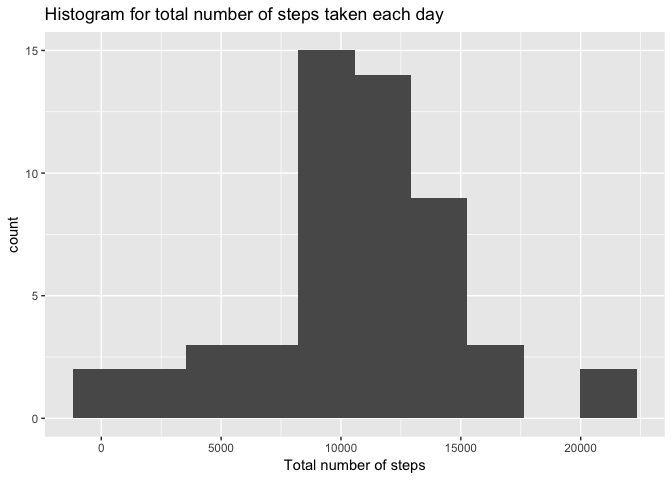
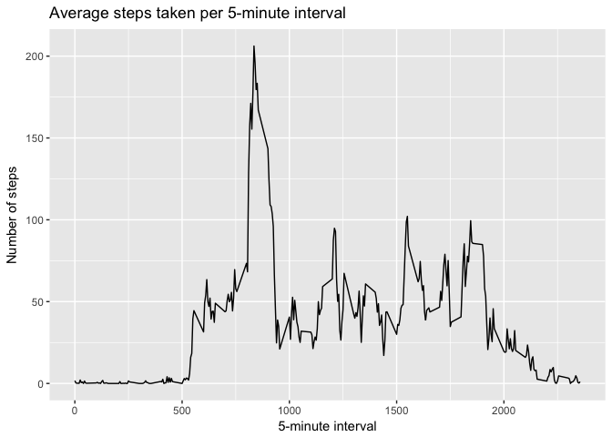
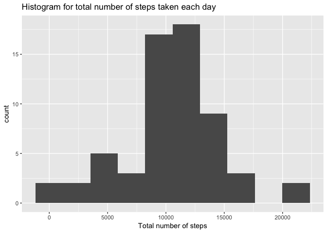
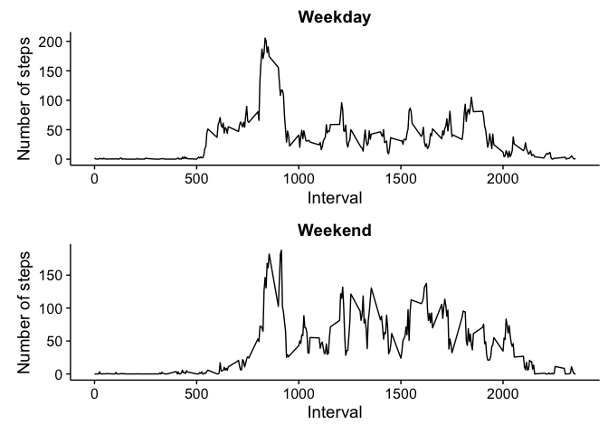

# Reproducible Research: Peer Assessment 1


### Loading and preprocessing the data


```r
data <- read.csv("activity.csv")
summary(data)
```

```
##      steps                date          interval     
##  Min.   :  0.00   2012-10-01:  288   Min.   :   0.0  
##  1st Qu.:  0.00   2012-10-02:  288   1st Qu.: 588.8  
##  Median :  0.00   2012-10-03:  288   Median :1177.5  
##  Mean   : 37.38   2012-10-04:  288   Mean   :1177.5  
##  3rd Qu.: 12.00   2012-10-05:  288   3rd Qu.:1766.2  
##  Max.   :806.00   2012-10-06:  288   Max.   :2355.0  
##  NA's   :2304     (Other)   :15840
```

### What is mean total number of steps taken per day?

1. Remove rows with NA from the data


```r
pos <- is.na(data[,1]) # Find NA objects
data1 <- data[!pos,] # creat data without NA values
summary(data1)
```

```
##      steps                date          interval     
##  Min.   :  0.00   2012-10-02:  288   Min.   :   0.0  
##  1st Qu.:  0.00   2012-10-03:  288   1st Qu.: 588.8  
##  Median :  0.00   2012-10-04:  288   Median :1177.5  
##  Mean   : 37.38   2012-10-05:  288   Mean   :1177.5  
##  3rd Qu.: 12.00   2012-10-06:  288   3rd Qu.:1766.2  
##  Max.   :806.00   2012-10-07:  288   Max.   :2355.0  
##                   (Other)   :13536
```

2. Calculate the total number of steps taken per day


```r
dates <-unique(data1[,2])  # Find dates
ttstep <- integer() # Vector contains total number of steps per day
for (d in 1:length(dates)) {
        ttstep[d] <- sum(data1[data1$date %in% dates[d],1])
}
ttstep <- data.frame(ttstep, dates)
summary(ttstep)
```

```
##      ttstep             dates   
##  Min.   :   41   2012-10-02: 1  
##  1st Qu.: 8841   2012-10-03: 1  
##  Median :10765   2012-10-04: 1  
##  Mean   :10766   2012-10-05: 1  
##  3rd Qu.:13294   2012-10-06: 1  
##  Max.   :21194   2012-10-07: 1  
##                  (Other)   :47
```

3. A histogram of the total number of steps taken each day


```r
library(ggplot2)
```

```
## Warning: package 'ggplot2' was built under R version 3.3.2
```

```r
qplot(ttstep$ttstep,
      geom="histogram",
      bins = 10,  
      main = "Histogram for total number of steps taken each day", 
      xlab = "Total number of steps")
```

<!-- -->

4. Calculate the mean and median of the total number of steps taken per day


```r
meanstep <- round(mean(ttstep$ttstep),2)
medianstep <- median(ttstep$ttstep)
```

The mean and median of the total number of steps taken per day are 10766.19 and 10765, respectively.

### What is the average daily activity pattern?

1. Make a time series plot (i.e. 𝚝𝚢𝚙𝚎 = "𝚕") of the 5-minute interval (x-axis) and the average number of steps taken, averaged across all days (y-axis)


```r
ti <-unique(data1[,3])  # Find time intrerval (ti)
tistep <- integer() # Vector contains average number of steps of 5-minute interval
for (d in 1:length(ti)) {
        tistep[d] <- mean(data1[data1$interval %in% ti[d],1])
}
ts <- data.frame(ti, tistep)
library(ggplot2)
qplot(ti, tistep, data=ts,
      geom="line",
      main = "Average steps taken per 5-minute interval", 
      xlab = "5-minute interval",
      ylab = "Number of steps")
```

<!-- -->

2. Which 5-minute interval, on average across all the days in the dataset, contains the maximum number of steps?


```r
maxint <- ts[ts$tistep %in% max(ts$tistep),1]
```

On average across all the days in the dataset, the time inveral 835 contains the maximum number of steps.

### Imputing missing values

Note that there are a number of days/intervals where there are missing values (coded as 𝙽𝙰). The presence of missing days may introduce bias into some calculations or summaries of the data.

1. Calculate and report the total number of missing values in the dataset.


```r
pos <- is.na(data[,1]) # Find NA objects
nms <- length(pos) # number of missing values
```

Total number of missing values is 17568.

2. Devise a strategy for filling in all of the missing values in the dataset. The strategy does not need to be sophisticated. For example, you could use the mean/median for that day, or the mean for that 5-minute interval, etc.

Find the number of missing values per day


```r
dates <-unique(data[,2])  # Find dates
nms <- integer() # Vector contains total number of missing values per day
for (d in 1:length(dates)) {
        subdata <- data[data$date %in% dates[d],1] # data for each day
        nms[d] <- length(subdata[is.na(subdata)])
}
ttms <- data.frame(nms, dates)
summary(ttms)
```

```
##       nms                dates   
##  Min.   :  0.00   2012-10-01: 1  
##  1st Qu.:  0.00   2012-10-02: 1  
##  Median :  0.00   2012-10-03: 1  
##  Mean   : 37.77   2012-10-04: 1  
##  3rd Qu.:  0.00   2012-10-05: 1  
##  Max.   :288.00   2012-10-06: 1  
##                   (Other)   :55
```

From the results, it can be seen that there are 8 days without data (missing values all the day). They are 2012-10-01, 2012-10-08, 2012-11-01, 2012-11-04, 2012-11-09, 2012-11-10, 2012-11-14, 2012-11-30.

To fill the missing values of these 8 missing date, take the data from other dates. The chosen date (without missing data) is chosen randomly.

3. Create a new dataset that is equal to the original dataset but with the missing data filled in.

Reshape the data to easy process. Create a matrix where the rows indicate the 5-minute interval and the column indicate the date. In other words, each column contain data of one date.


```r
st <- data$steps
redata <- matrix(st, length(st)/length(dates), length(dates))
head(redata)
```

```
##      [,1] [,2] [,3] [,4] [,5] [,6] [,7] [,8] [,9] [,10] [,11] [,12] [,13]
## [1,]   NA    0    0   47    0    0    0   NA    0    34     0     0     0
## [2,]   NA    0    0    0    0    0    0   NA    0    18     0     0     0
## [3,]   NA    0    0    0    0    0    0   NA    0     7     0     0     0
## [4,]   NA    0    0    0    0    0    0   NA    0     0     8     0     0
## [5,]   NA    0    0    0    0    0    0   NA    0     0     0     0     0
## [6,]   NA    0    0    0    0    0    0   NA   13     0     0     0     0
##      [,14] [,15] [,16] [,17] [,18] [,19] [,20] [,21] [,22] [,23] [,24]
## [1,]     0     0     0     0     0     0     0     0    10     0     0
## [2,]     0     0     0     0     0     0     0     0     0     0     0
## [3,]     0     0     0     0     0     0     0     0     0     0     0
## [4,]     0     0     0     0     0     0     0     0     0     0     0
## [5,]     0     0     0     0     0     0     0     0     0     4     0
## [6,]    52    35     0     0    11     0     0     0     0     0     0
##      [,25] [,26] [,27] [,28] [,29] [,30] [,31] [,32] [,33] [,34] [,35]
## [1,]     0     0     0     0     0     0     0    NA     0     0    NA
## [2,]     0     0     0     0     0     0     0    NA     0     0    NA
## [3,]     0     0     0     0     0     0     0    NA     0     0    NA
## [4,]     0     0     0     0     0     0     0    NA     0     0    NA
## [5,]     0     0     0     0     0     0     0    NA     0     0    NA
## [6,]     0     0     0     0     0     0     0    NA     0     0    NA
##      [,36] [,37] [,38] [,39] [,40] [,41] [,42] [,43] [,44] [,45] [,46]
## [1,]     0     0     0     0    NA    NA     0     0     0    NA     0
## [2,]     0     0     0     0    NA    NA     0     0     0    NA     0
## [3,]     0     0     0     0    NA    NA     0     0     0    NA     0
## [4,]     0     0     0     0    NA    NA     0     0     0    NA     0
## [5,]     0     0     0     0    NA    NA     0     0     0    NA     0
## [6,]     0     0     0     0    NA    NA     0     0     0    NA     0
##      [,47] [,48] [,49] [,50] [,51] [,52] [,53] [,54] [,55] [,56] [,57]
## [1,]     0     0     0     0     0     0     0     0     0     0     0
## [2,]     0     0     0     0     0     0     0     0     0     0     0
## [3,]     0     0     0     0     0     0     0     0     0     0     0
## [4,]     0     0     0     0     0     0     0     0     0     0     0
## [5,]     0     0     0     0     0     0     0     0     0     0     0
## [6,]     0     0     0     0     0     0     0     0     0     0     0
##      [,58] [,59] [,60] [,61]
## [1,]     0     0     0    NA
## [2,]     0     0     0    NA
## [3,]     0     0     0    NA
## [4,]     0     0     0    NA
## [5,]     0     0     0    NA
## [6,]     0     0     0    NA
```

Chose random dates, then copy the data to the missing-data dates.


```r
md <- c(1, 8, 32, 35, 40, 41, 45, 61) # column with missing-data dates
a <- c(1:61)
ad <- a [! a %in% md] # column with dates has data
for (k in 1:length(md)) {
        # select random date 
        srd <- sample(ad,1)
        redata[,md[k]] <- redata[,srd]
}
# reshape data to the original form
steps <- matrix(redata, 288*61,1)
data2 <- data.frame(steps, data[,c(2,3)])
head(data2)
```

```
##   steps       date interval
## 1     0 2012-10-01        0
## 2     0 2012-10-01        5
## 3     0 2012-10-01       10
## 4     0 2012-10-01       15
## 5     0 2012-10-01       20
## 6     0 2012-10-01       25
```

```r
summary(data2)
```

```
##      steps                date          interval     
##  Min.   :  0.00   2012-10-01:  288   Min.   :   0.0  
##  1st Qu.:  0.00   2012-10-02:  288   1st Qu.: 588.8  
##  Median :  0.00   2012-10-03:  288   Median :1177.5  
##  Mean   : 36.88   2012-10-04:  288   Mean   :1177.5  
##  3rd Qu.: 12.00   2012-10-05:  288   3rd Qu.:1766.2  
##  Max.   :806.00   2012-10-06:  288   Max.   :2355.0  
##                   (Other)   :15840
```

4. Make a histogram of the total number of steps taken each day. Calculate and report the mean and median total number of steps taken per day. Do these values differ from the estimates from the first part of the assignment? What is the impact of imputing missing data on the estimates of the total daily number of steps?

Make a histogram of the total number of steps taken each day.


```r
dates2 <-unique(data2[,2])  # Find dates
ttstep2 <- integer() # Vector contains total number of steps per day
for (d in 1:length(dates2)) {
        ttstep2[d] <- sum(data2[data2$date %in% dates2[d],1])
}
ttstep2 <- data.frame(ttstep2, dates2)
library(ggplot2)
qplot(ttstep2$ttstep2,
      geom="histogram",
      bins = 10,  
      main = "Histogram for total number of steps taken each day", 
      xlab = "Total number of steps")
```

<!-- -->

Calculate the mean and median total number of steps taken per day.


```r
meanstep2 <- round(mean(ttstep2$ttstep2),2)
medianstep2 <- median(ttstep2$ttstep2)
```

The mean and median of the total number of steps taken per day are 10621.18 and 10765, respectively.

These values differ from the estimates from the first part of the assignment. Imputing missing data has decreased the values on the estimates of the total daily number of steps. For example, the mean total number of steps taken per day is 10621.18 compared to that of the previous exercise 10766.19.

### Are there differences in activity patterns between weekdays and weekends?

1. Create a new factor variable in the dataset with two levels – “weekday” and “weekend” indicating whether a given date is a weekday or weekend day.


```r
data2[,2] <- as.Date(data2[,2]) # Convert data2$date from factor class to date class
daytype <- weekdays(data2[,2])
data2 <- data.frame(data2, daytype) # add day to the data frame
head(data2)
```

```
##   steps       date interval daytype
## 1     0 2012-10-01        0  Monday
## 2     0 2012-10-01        5  Monday
## 3     0 2012-10-01       10  Monday
## 4     0 2012-10-01       15  Monday
## 5     0 2012-10-01       20  Monday
## 6     0 2012-10-01       25  Monday
```

Create a new factor variable in the dataset with two levels – “weekday” and “weekend”.


```r
weekends <- c("Saturday","Sunday")
wd <- as.character() # vector contain variable “weekday” and “weekend”
for (i in 1:nrow(data2)) {
        if (data2[i,4] %in% weekends) {
                wd[i] <- c("weekend")}
        else {wd[i] <- c("weekday")}
}
data2 <- data.frame(data2[,c(1,2,3)], wd)
head(data2)
```

```
##   steps       date interval      wd
## 1     0 2012-10-01        0 weekday
## 2     0 2012-10-01        5 weekday
## 3     0 2012-10-01       10 weekday
## 4     0 2012-10-01       15 weekday
## 5     0 2012-10-01       20 weekday
## 6     0 2012-10-01       25 weekday
```

2. Make a panel plot containing a time series plot (i.e. 𝚝𝚢𝚙𝚎 = "𝚕") of the 5-minute interval (x-axis) and the average number of steps taken, averaged across all weekday days or weekend days (y-axis). 

Calculate the average number of steps taken per 5-minute interval for weekday days

```r
WDdata <- data2[data2$wd %in% "weekday",]
ti <-unique(WDdata[,3])  # Find time intrerval (ti)
tistepWD <- integer() # Vector contains average number of steps of 5-minute interval
for (d in 1:length(ti)) {
        tistepWD[d] <- mean(WDdata[WDdata$interval %in% ti[d],1])
}
tsWD <- data.frame(ti, tistepWD)
```

Calculate the average number of steps taken per 5-minute interval for weekend

```r
WKdata <- data2[data2$wd %in% "weekend",]
tistepWK <- integer() # Vector contains average number of steps of 5-minute interval
for (d in 1:length(ti)) {
        tistepWK[d] <- mean(WKdata[WKdata$interval %in% ti[d],1])
}
tsWK <- data.frame(ti, tistepWK)
```

Make a panel plot


```r
# install.packages("cowplot")
library(cowplot)
```

```
## 
## Attaching package: 'cowplot'
```

```
## The following object is masked from 'package:ggplot2':
## 
##     ggsave
```

```r
library(ggplot2)
p1 <- qplot(ti, tistepWD, data=tsWD,
      geom="line",
      main = "Weekday", 
      xlab = "Interval",
      ylab = "Number of steps")
p2 <- qplot(ti, tistepWK, data=tsWK,
      geom="line",
      main = "Weekend", 
      xlab = "Interval",
      ylab = "Number of steps")
plot_grid(p1, p2, ncol=1)
```

<!-- -->
